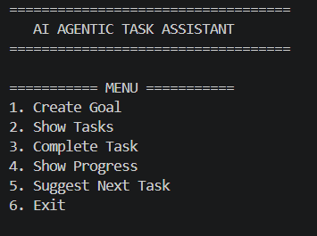
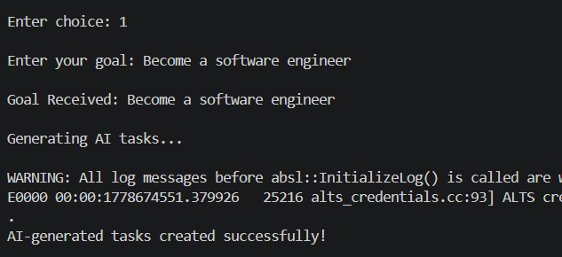
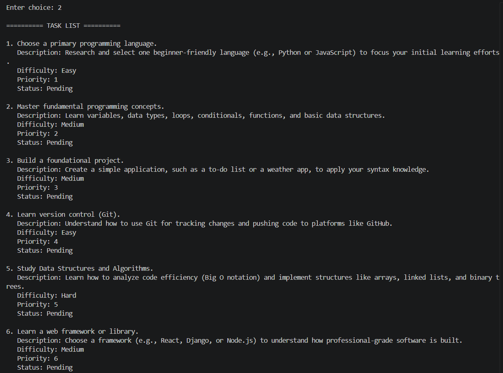
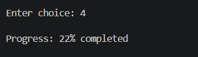
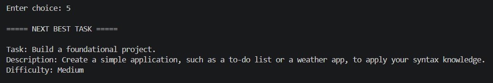

# AI-Powered Agentic Task Assistant

An AI-powered productivity assistant built with Python and the Gemini API that converts user goals into structured tasks, tracks progress, and provides intelligent next-step suggestions.

---

## Features

- AI-generated task breakdown from user goals  
- Structured tasks with description and difficulty level  
- Task completion tracking system  
- Progress percentage display  
- Smart “next best task” recommendation  
- Persistent storage using JSON  
- Simple command-line interface  

---

## Tech Stack

Python, Google Gemini API, JSON, Object-Oriented Programming

---

## Project Structure

agentic-ai-task-assistant.py → Main program file  
tasks.json → Auto-generated file for storing tasks  
.gitignore → Files ignored by Git  

---

## Screenshots

### Main Menu

### AI Task Generation

### Task List

### Progress Tracking

### Next Task Suggestion
 

---

## How to Run

Clone the repository:
git clone https://github.com/404-sleepnotfound/AI-Powered-Agentic-Task-Assistant.git

Install dependencies:
pip install google-generativeai

Run the program:
python agentic-ai-task-assistant.py

---

## Future Improvements

- GUI version using Tkinter or web interface  
- User accounts and authentication  
- Cloud-based task storage  
- Memory-based AI planning  
- Mobile app version  

